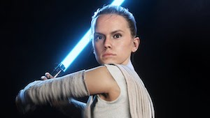
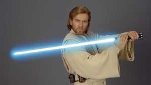
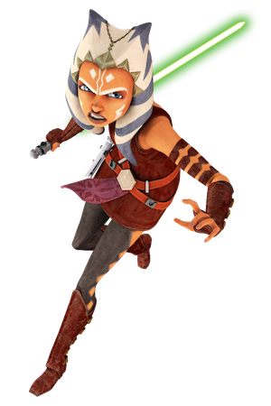
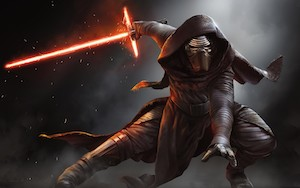
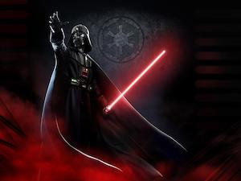
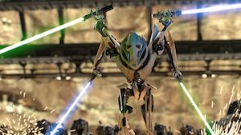

# Star Wars.com

## Fighting Heroes

### Rey

Rey is a strong fighter and she's also very daring! Rey is learning how to use the force very strongly. She can also fly ships! Rey is a very skilled fighter. She has a big, long staff that she holds in the middle and uses it to battle! She also has a light saber like most of the other heroes and some of the villains. She is my favorite character.

### Finn

Finn used to be a storm trooper but realized he was on the wrong side and is now part of the Resistance! Would you want to join the Resistance with Rey and Finn? When we realized he was on the wrong side he bravely escaped and joined the Resistance!

### Princess Leia Organa

Princess Leia Organa is brave and smart. Once she hid with Chewbacca and Hans Solo and Luke and fought all these stormtroopers! And then she shot a hole into this garbage composer so they could be saved! But surprisingly... she doesn't have a light saber!

### Luke Skywalker

Luke gets trained from Yoda! Luke is a Jedi who knows how to use the force very powerfully. Once he saved Princess Leia, Han Solo and Chewbacca and C3PO and R2D2 from the Empire by battling with Darth Vader. And then he realized something I'm not going to tell you cause it's a surprise and you're going to find it out once you see the movie. And when he was battling Darth Vader his hand got chopped off!

### Yoda

Yoda is the strongest Jedi master! Wise Yoda is more than 900 years old. He is the most powerful Jedi and the best at lightsaber battles. So don't be fooled by his small size! He is very strong.

### Obi-Wan Kenobi

In the first movie, Obi-Wan turns out to be called Old Ben by Luke but he realized Obi-Wan is a Jedi and helps him learn how to be a Jedi, too.

### Ahsoka Tano

> Pronunciation: A-s-o-cu Ta-n-o

She is an alien but she looks like a human. She is Anakin's padawan (which is someone who is in the first level of Jedi training). Ahsoka is in The Clone Wars and arrives again in The Mandalorian. She holds her lightsaber in a backgrip which is an ancient style. She weaves her padawan braid out of silk beads, which you can see in the picture.

## Strange Creatures

### Jawa

Don't leave anything lying around when Jawas are near. These short creatures will steal anything they see! They have glowing eyes. They are very good hiders. They usually wear a brown coat and they're all black. Next creature!

### Jabba the Hutt

You don't want to use your wallet when Jabba's around. He loves money and he wants every kind of money he sees. His favorite things are power and money. Han Solo borrowed some money from him and he had to chop a green guy's arm off because the green guy wanted him to give his money back, but I didn't like that. He is like a big snake whose body gets bigger until he has a huge head and his chin is attached to his neck. The big Jabba the Hutt also has arms that are really close to his big head. Lastly, he slithers like a snake, too.

### Chewbacca

He is this big, hairy, gorilla-like thing! And he helps Han Solo with the Millennium Falcon which you're going to learn about in Awesome Ships! Is he actually dangerous? Yes! Very. Even if you're his friend.

### Sebulba

He loves podraces, but his way to win isn't good. Whoever is ahead of him, he smashes into that person to win. He does everything to hurt Anakin Skywalker but he still can't beat him.

## The Dangerous Empire

### Kylo Ren!!!

He has a lightsaber that has two small lightsabers coming out of either side! He looks like Darth Vader but much scarier. Beware of him, he has dark powers. Kylo Ren is Leia and Han's son. He was trying to be a Jedi but was tempted by the dark side. Now he works for the scary First Order.

### Darth Vader

Darth Vader is powerful in the dark side of the force. He hurts people that do things he doesn't like, even if they're part of the dark side. I don't think that's very good of him, but he is on the dark side.

> <video controls width="100%" height="60px" src="https://github.com/nikhiltri/star-wars-dot-com/blob/main/audio/darth-vadar-breathing.webm?raw=true"></video>

### General Grievous

General Grievous has four arms and is a very bad, bad, bad guy. He has lightsabers that he stole from Jedis. How would you battle General Grievous?

## [Troopers](troopers.html)

## Droids

### PZ-4CO

It's a blue droid that looks like it has googles, but with lights. It has a neck that disappears so you can see the inner mechanical part before it gets to the head. The same thing happens with its waist. It has a kind of dome shape on its head. And it kind of looks like R2D2 except it's blue and there are other differences I can't really explain.

### 2-1B Medical Droid

It has three hexagons in its eye to make a triangle. One hand is a grabber and one hand is a shot. It has legs that look like they can extend. And it can make new things like parts of a body.

### B-U4D

It is yellow with a glowing circle for an eye. It has a very square-shaped face that does not look like a human's. It has hands that kind of look like one of the medical droid grabber hands. And two legs that look like they're sealed together!

### R4-P17

It is a red R2D2. The screw thing is a little smaller than R2D2's though.

### C-3PO

He is a hello human-like mechanical droid. He looks a lot like a human, too. He has some wires sticking out of one little part where two parts break of from each other in the middle of his body, a little under his belly button.

### BB-8

He is Rey's droid. He is an orange-grey ball-spaced droid that rolls around to move with a half-circle head. He kind of looks like an R2D2 that's white with orangle circles with grey inside of those orange circles and those orange circles are on another big ball.

Which is your favorite droid?

### R2D2

He has jets that help him fly. He has a sphere body with a half-circle head and little, round-topped movable legs. He is Luke's droid. So is C-3PO.

## Ships

### Y-wing

They have laser shooters in the front of the cockpit, which is at the back of the front. And then lasers coming out of the very front. The wings are kind of shaped like a bomb that is going so fast that it's creating a big almost sphere after it, then poles are coming out to create a circle with a propeller in it. Why it's called Y-wing is because the ship is shaped like a Y, but the actual Y part is in the back with the propellers in the back. Droids can fit in Y-wings.

### Jedi Starfighter

Jedi Starfighters are triangle-shaped. They can also fit droids in them. Every droid in every ship usually makes repairs. This ship has the Jedi symbol on it.

### Millennium Falcon

It is very fast. It can go to light speed! When it flies the back of it glows blue.
